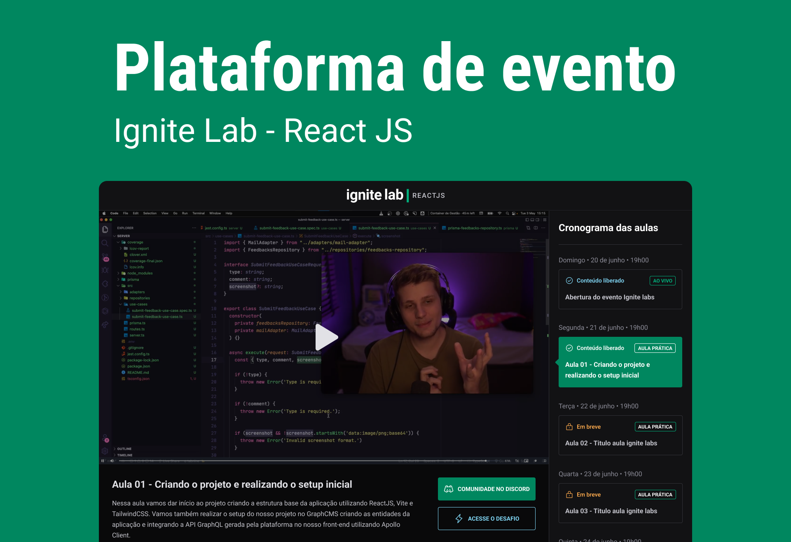

<!-- Logotipo -->
<div align="center">
  
</div>

<!-- Logo -->
<h1 align="center"> Plataforma de eventos em vídeo </h1>
<!-- Sobre o Projeto -->

## 🧐 Sobre o Projeto

Projeto apresentado no IgniteLab abordando o uso do react para construção de uma plataforma de eventos, onde cada conteúdo é liberado através do painel do GraphCMS

## 🚀 Tecnologias e Bibliotecas

- [ReactJS](https://reactjs.org/)
- [Typescript](https://www.typescriptlang.org/)

## 💻 Rodando o Projeto

```bash
# Realize o Clone deste repositório
$ https://github.com/lucasbarque/EventPlatform.git
# ou use a opção de download.
# Acesse a pasta EventPlatform
$ cd EventPlatform
# Instale as dependências
$ yarn install
ou
$ npm install
# Executando o Projeto
$ yarn dev
ou
$ npm run dev
# Acesse http://localhost:3000 no seu navagador
```
